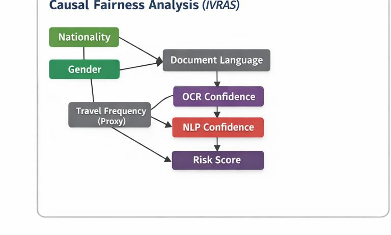
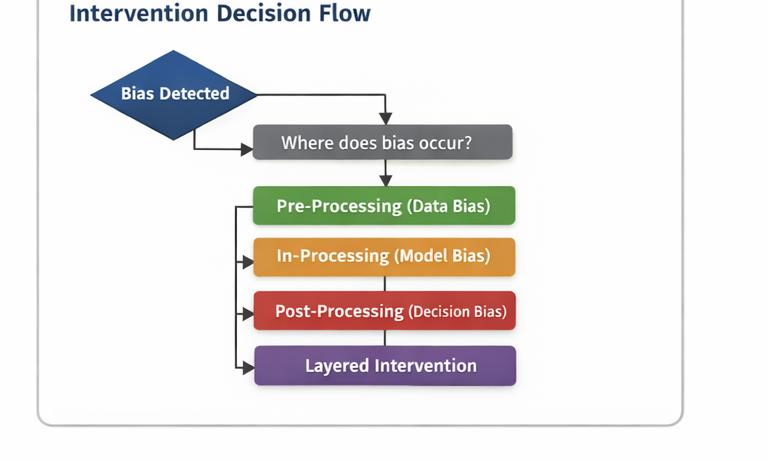

# AI Fairness Governance & Intervention Playbook

## Overview

This repository presents a structured, audit-ready fairness playbook for AI systems, enabling organizations to systematically detect, diagnose, mitigate, validate, and govern bias across the entire machine learning lifecycle.

Unlike ad hoc fairness fixes, this playbook introduces a closed-loop, decision-driven framework that integrates:

- Causal fairness analysis  
- Risk-based intervention selection  
- Multi-stage bias mitigation (data, model, decision)  
- Validation and monitoring  
- Governance and audit documentation  

The framework is designed for high-risk AI systems, where fairness failures can lead to regulatory, ethical, and societal harm.

---

## Problem Statement

AI systems often exhibit systemic, multi-stage bias due to:

- Data imbalance and measurement errors  
- Proxy variables encoding protected attributes  
- Model amplification of disparities  
- Decision threshold effects  

Most organizations lack:

- A causally grounded intervention strategy  
- Clear decision logic for selecting mitigation techniques  
- Audit-ready governance workflows  

This leads to:

- Ad hoc fixes  
- Inconsistent outcomes  
- Limited scalability  
- Compliance risks  

---

## Solution: Closed-Loop Fairness System

The playbook introduces a controlled fairness lifecycle:

Disparity Detection → Causal Analysis → Risk Classification →  
Intervention Selection → Implementation → Validation →  
Governance Approval → Monitoring

This workflow is:

- Causally justified (not heuristic)  
- Risk-aware (aligned with system impact)  
- Iterative (continuous monitoring and re-entry)  
- Fully documented (audit-ready)  

---

## Core Components

### 1. Causal Fairness Analysis

- Identifies root causes of bias using causal reasoning  
- Maps relationships between protected attributes, proxy variables, and outcomes  
- Detects multi-stage bias propagation  

Example (IVRAS):

Nationality → Document Language → OCR Confidence → NLP Confidence → Risk Score → Rejection  
Gender interacts at the decision stage  
Travel Frequency acts as a proxy variable  

---

### 2. Risk-Based Intervention Selection

Intervention selection is based on:

- Where bias enters the system (data, model, decision)  
- System risk classification (high vs lower risk)  
- Technical and operational constraints  

Intervention Mapping:

- Data bias → Pre-processing  
- Model bias → In-processing  
- Decision bias → Post-processing  
- Multi-stage bias → Layered intervention  

---

### 3. Multi-Layer Intervention Strategy

- **Pre-processing (Data Fixes)**  
  - Rebalancing datasets  
  - Correcting measurement errors  
  - Normalizing features  

- **In-processing (Model Fixes)**  
  - Fairness constraints  
  - Loss function adjustments  
  - Proxy feature control  

- **Post-processing (Decision Fixes)**  
  - Threshold adjustments  
  - Reject-option classification  
  - Human review for edge cases  

Layered intervention is applied when bias exists across multiple stages.

---

### 4. Validation & Monitoring

Validation acts as a decision gate and answers:

1. Did fairness improve?  
2. Is performance acceptable?  
3. Did new bias emerge?  

Includes:

- Error-based metrics (FPR, FRR)  
- Outcome-based metrics (disparity, selection rates)  
- Stability checks across time  

No intervention is considered complete without passing validation.

---

### 5. Governance & Documentation

- Risk classification (high vs lower risk systems)  
- Mandatory documentation templates  
- Final intervention report as single source of truth  
- Approval workflows before deployment  

Key rule:

"If it is not documented, it is not approved."

---

## End-to-End Workflow

The playbook enforces a controlled lifecycle:

- Bias detected → triggers causal analysis  
- Validation failure → returns to diagnosis  
- Post-deployment drift → re-enters workflow  

Fairness is treated as a continuous governance process, not a one-time fix.

---

## Case Study: IVRAS (Immigration Visa Risk Assessment System)

### Key Findings

- Intersectional bias against South Asian women  
- Multi-stage bias across data, model, and decision layers  

### Intervention Strategy

- Pre-processing → data correction  
- In-processing → fairness constraints  
- Post-processing → threshold adjustment  

### Outcome

- Reduced disparity  
- Maintained acceptable performance  
- Enabled governance compliance  

---

## Repository Structure

00-introduction/  
01-intervention-workflow/  
02-causal-fairness-analysis/  
03-risk-based-intervention-selection/  
04-pre-processing/  
05-in-processing/  
06-post-processing/  
07-validation-and-monitoring/  
08-final-intervention-report/  
09-case-study/  
10-documentation-templates/  
11-references/  
12-glossary/  

---

## Key Contributions

- End-to-end fairness lifecycle framework  
- Integration of causal reasoning, ML interventions, and governance  
- Risk-based decision logic for high-impact AI systems  
- Audit-ready documentation templates  
- Real-world case study demonstrating application  

---

## Applicability

This playbook can be applied to:

- Credit scoring systems  
- Hiring and recruitment AI  
- Healthcare decision systems  
- Public sector risk assessment systems  

---

## Key Insight

Fairness is not a one-time technical fix.

It is a governed, iterative process that integrates data, models, and human oversight.

---

## Author

Disha Shetty
